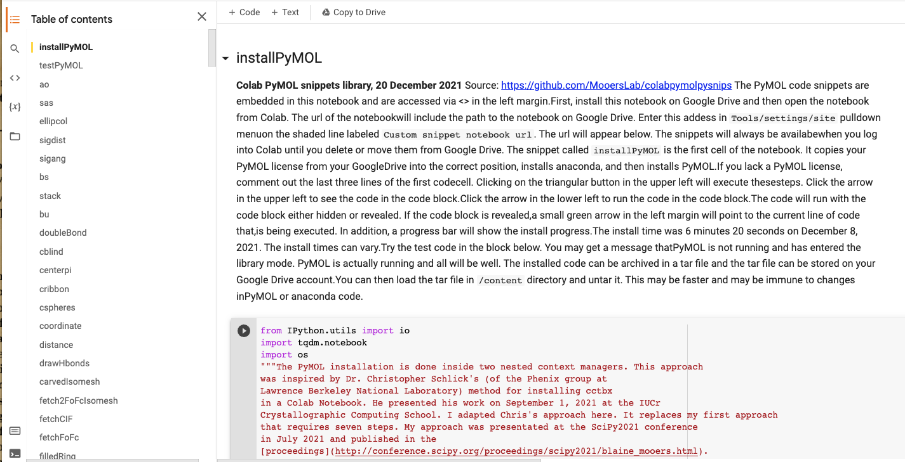
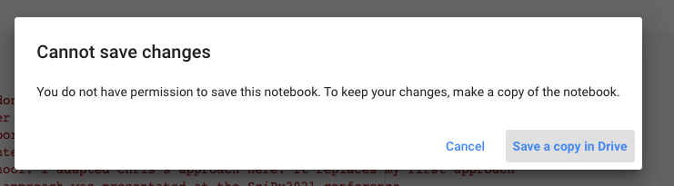
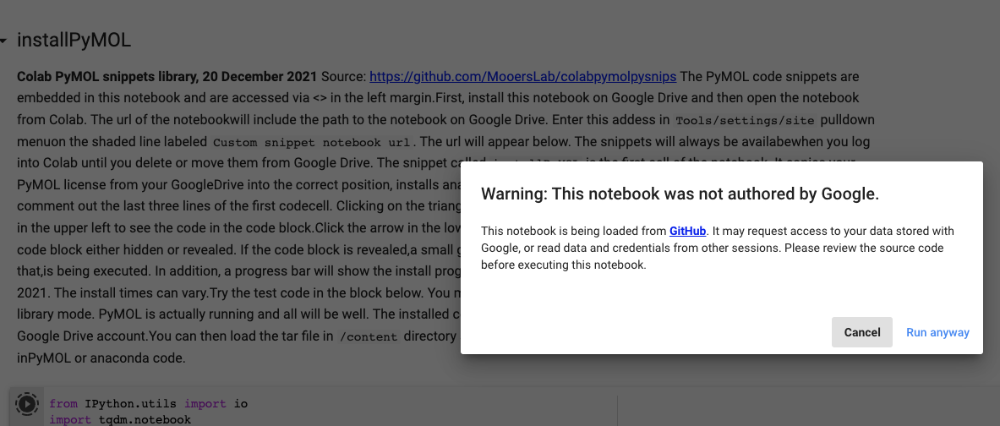
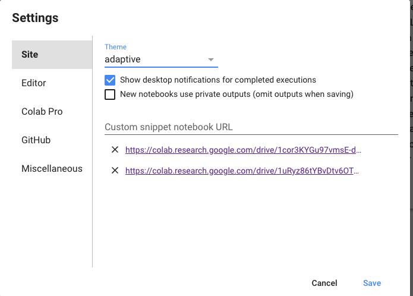
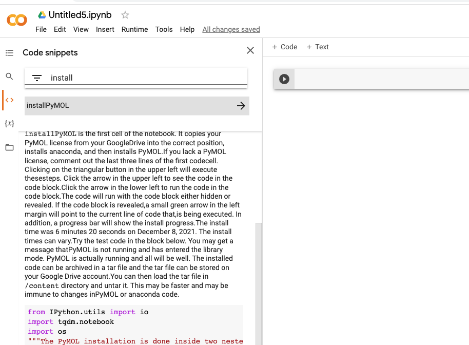
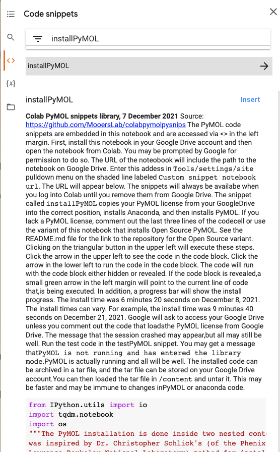
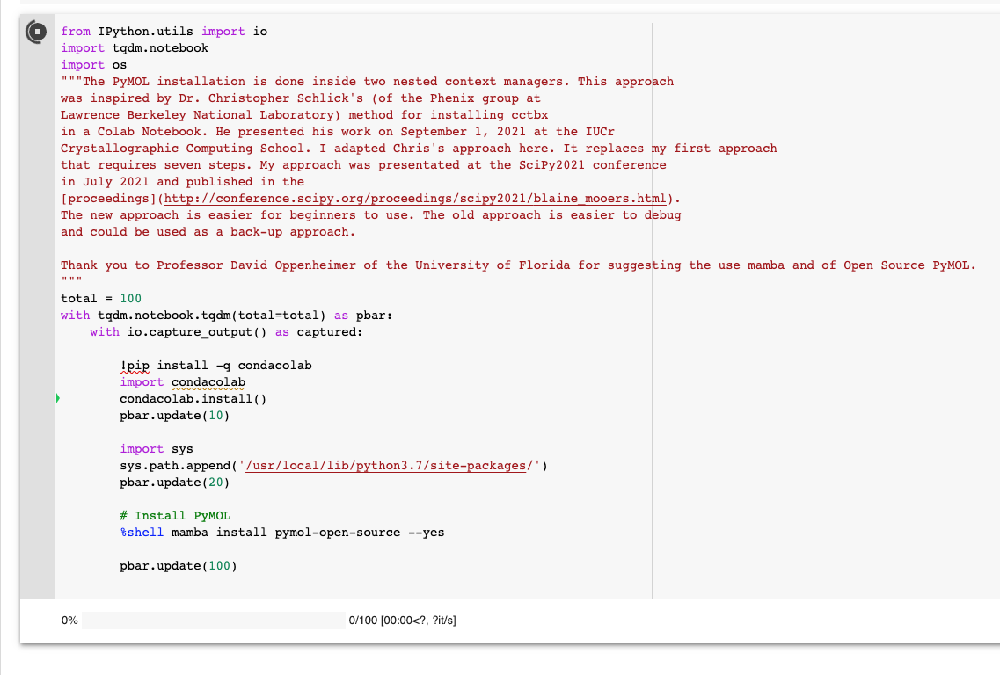
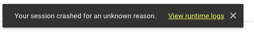
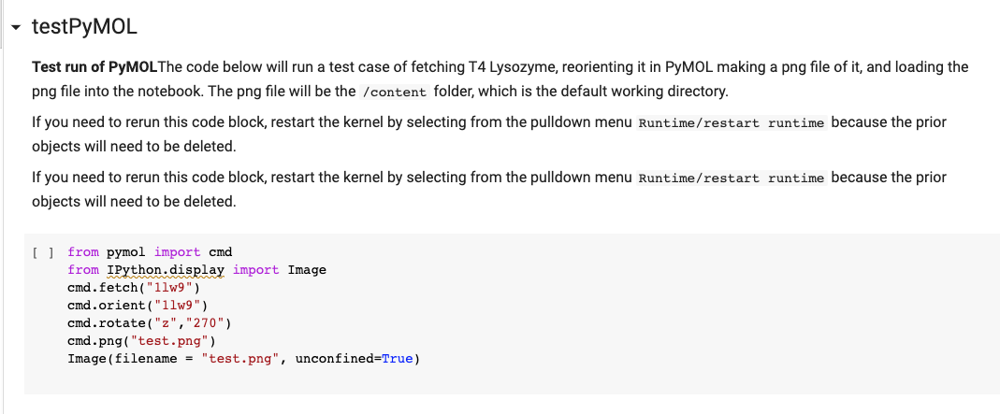
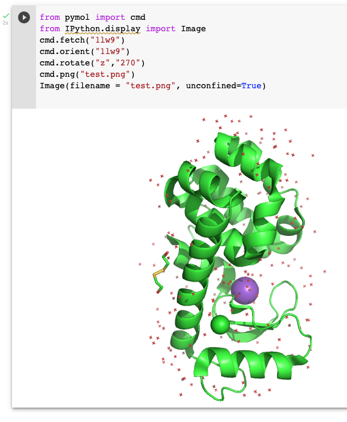

# colabOpenSourcePyMOLpySnips

## Library of PyMOL Python snippets for installing and running Open Source PyMOL on Google Colab via a Colab notebook

### version 0.2
### Go [here](https://github.com/MooersLab/colabpymolpysnips/edit/main/README.md) for the variant for the Incentive PyMOL.

Click on Colab bage to open notebook on Colab:

See the first cell in the notebook for install instructions.

The `installPyMOL` snippet will install PyMOL with one click of a button.
The install process takes 5-10 minutes, so be patient.
A progress bar monitors the progress of the installation. 

This readme file is a work in progress.

Pre-repuisite: a Google Drive account.

### Step 1: Click on the above colab link
This action will open the snippet notebook on Colab.
The top of the screen should look like the following:

### Step 2: Copy the snippet notebook to Google Drive

Use the `File/Save copy in Drive` pulldown menu item. 
If you run some code cells, you might get a message like the following:

Ignore this warning. Click on `run anyway`i

### Step 3: Paste the URL of the snippet notebook into the settings

Paste the URL onto the line `Custom snippet notebook URL`:

### Step 4: Open a new Colab notebook

### Step 5: Seach for the installPyMOL snippet

### Step 6: Insert the installPyMOL snippet into the new notebook and run

This takes 5-10 mintues. Ignore this warning:

### Step 8: Insert the testPyMOL snippet and run

The result look like the following image:

### Step 9: Save finished notebook to Google Drive or download the Colab notebook

